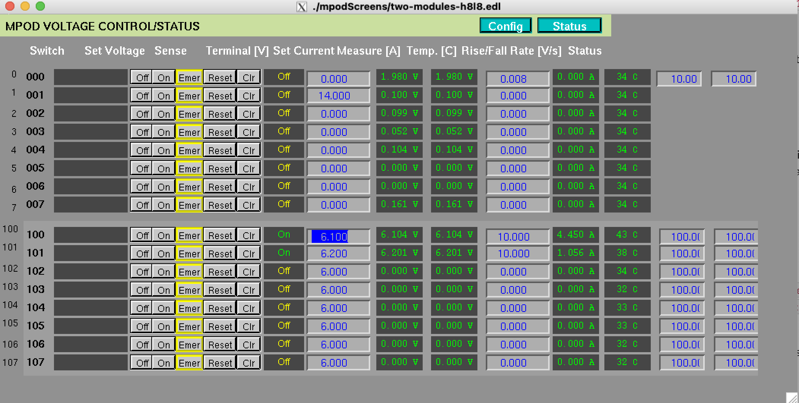

# Using ePix MPOD and IOC at UED

*Last updated: **Oct 8, 2025***

This document describes how to power on/off the **ePix detector** using
the **MPOD control interface** and how to launch the **IOC (Input/Output
Controller)** used for temperature monitoring and interlocks at the
**UED hutch**.

------------------------------------------------------------------------

## 1. Log in to the UED DAQ node

``` bash
ssh ued-daq -l uedopr
```

------------------------------------------------------------------------

## 2. Power control using the MPOD

The MPOD supplies power to the ePix detector and must be turned on in
the correct sequence to avoid triggering interlocks.

### Steps

``` bash
cd ~/ePix/ePix_control/ePix_MPOD
./edm-ioc-ued-mpod-01.cmd
```

This command opens the **EPICS EDM control panel** for the MPOD (see
attached screenshot).


### Power-on sequence

1.  **Turn ON switch 101**
    -   Wait until the current stabilizes at approximately **1.06 A**.\
    -   This powers part of the control electronics.
2.  **Turn ON switch 100**
    -   Wait until the current stabilizes around **4.45 A**.\
    -   This powers the main detector.

Once both switches are on and currents are stable, the **ePix detector
is ready for operation**.

### Power-off sequence

To safely power down the detector:

1.  Turn **OFF switch 100** first.\
2.  Then turn **OFF switch 101**.

This ensures the detector powers down in a safe and controlled manner.

------------------------------------------------------------------------

## 3. IOC (Input/Output Controller)

The IOC provides monitoring and temperature control for the ePix
detector via the Rogue interface. It automatically powers down the
detector if abnormal readings (e.g., temperature or current) are
detected.

### To launch the IOC control panel

``` bash
cd ~/ePix/ePix_control/ePix_mon
./edm-ioc-ued-epix-01.cmd
```

This opens the **IOC EDM control screen**, which normally displays
temperature, bias, and other monitoring values.

### Current status (as of Oct 8, 2025)

-   The **IOC is currently not functioning correctly** --- most
    registers show up as **0**.\
-   As a result, the IOC **interlocks and shuts down** the ePix shortly
    after startup.\
-   This issue is under investigation (tracked by Matt, Dan, and
    Julian).

### Expected behavior when working correctly

When functional, the IOC should: - Continuously read valid register
values (voltages, currents, temperatures).\
- Control and stabilize the detector temperature.\
- Automatically interlock only if a true fault condition occurs.

------------------------------------------------------------------------
## 4. Locating and Killing the ePix IOC Process (via procServ)

If the ePix IOC is running under `procServ`, you can identify and stop it as shown below.

### Step 1. Locate the running IOC

Log into the IOC host node (e.g., `drp-ued-cmp003`):

```bash
ssh drp-ued-cmp003
```

List all IOC-related processes:

```bash
ps -ef | grep proc
```

Look for a line similar to:

```
/reg/g/pcds/pyps/apps/IocManager/R2.5.6/startProc ioc-ued-epix-01 30001 ued ./st.cmd
```

From this line, note:
- **IOC name:** `ioc-ued-epix-01`  
- **Port number:** `30001` (used for telnet access)

---

### Step 2. Connect to the IOC process

Use telnet to connect to the IOC’s procServ port:

```bash
telnet localhost 30001
```

You should see output similar to:

```
Welcome to procServ
Child process is shutting down
Auto restart mode is disabled
```

---

### Step 3. Stop the IOC cleanly

Inside the telnet session, press:

```
Ctrl + X
```

This stops the IOC process gracefully and returns:

```
Connection closed by foreign host.
```

---

### Step 4. Verify

After disconnecting, confirm the IOC has stopped:

```bash
ps -ef | grep epix
```

You should no longer see the `ioc-ued-epix-01` entry.

---

## 5. Troubleshooting
```
  ------------------------------------------------------------------------
  Symptom                Likely Cause                      Notes
  ---------------------- --------------------------------- ---------------
  Detector powers off    IOC interlock due to bad register Disable IOC
  immediately after      reads                             temporarily and
  enabling MPOD                                            recheck
                                                           communication

  Current values not     Fault in MPOD configuration or    Verify switch
  stabilizing            load                              sequence (101
                                                           before 100)

  Registers show zeros   IOC-firmware communication issue  Firmware/VC3
  in IOC EDM screen                                        data path issue
                                                           under
                                                           investigation
  ------------------------------------------------------------------------
```
------------------------------------------------------------------------

## 6. Contacts
```
  ------------------------------------------------------------------------
  Role                   Name                   Notes
  ---------------------- ---------------------- --------------------------
  Firmware / IOC Debug   Matt Weaver            Investigating VC3
                                                communication issue

  Software / Integration Julian Mendez          Working on IOC register
                                                mapping

  Detector Support       Dan / Mona             Power cycling and DAQ
                                                integration
  ------------------------------------------------------------------------
```
